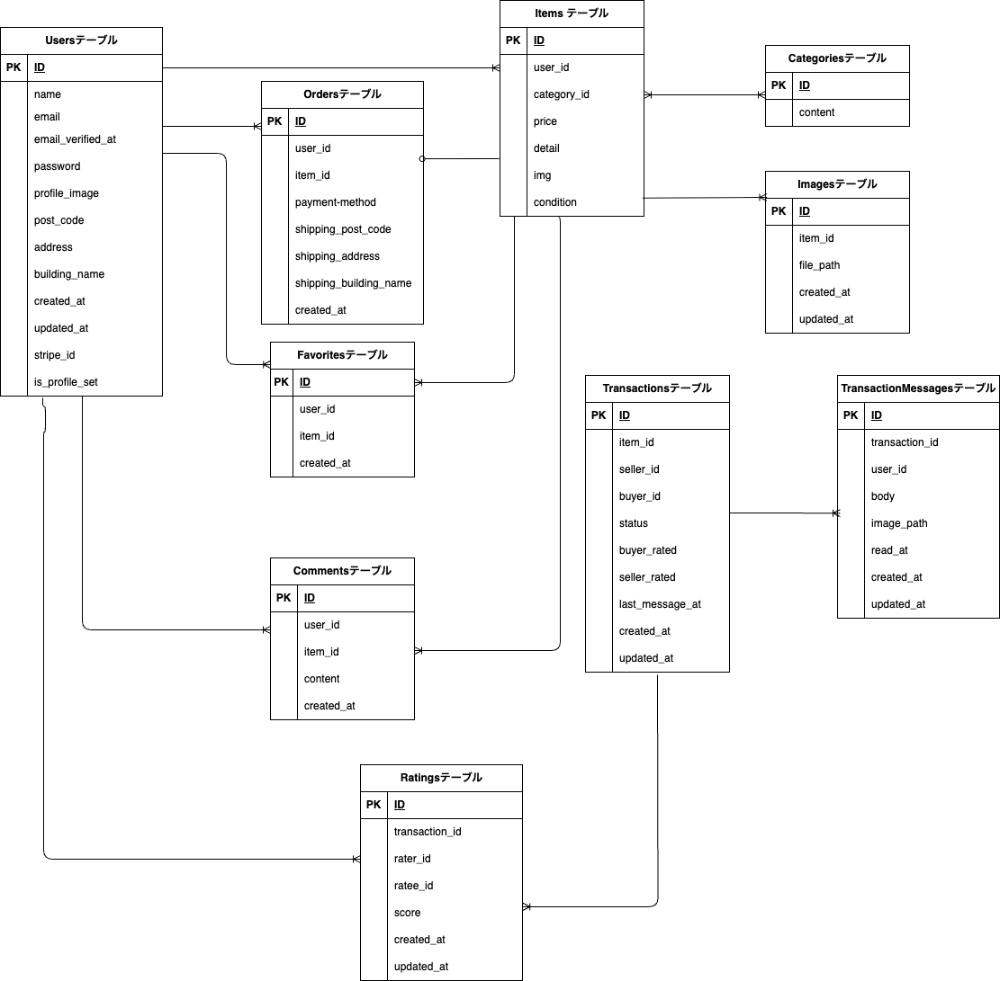

# アプリケーション名
**「coachtech フリマアプリ」**

## 環境構築

#### Docker のビルド
  1. リポジトリをクローン
   
    `git clone git@github.com:kazyuaki/contact-form-test.git`

  2. コンテナをビルド&起動
   
    `docker-compose up -d --build`

  ※MySQL は、OS によって起動しない場合があるので、それぞれの PC に合わせて.  `docker-compose.yml` ファイルを編集してください

#### Laravel 環境構築

1. コンテナに入る
   
    `docker-compose exec php bash`

2. 依存パッケージをインストール
   
    `composer install`

3. 環境変数ファイルをコピー
   
    `cp .env.example env` 

4. アプリケーションキーを生成
   
    `php artisan key:generate`
  
5. マイグレーション
   
    `php artisan migrate`

6. シーディング
   
    `php artisan db:seed`

#### 管理者サンプルアカウント
シーディング後、以下のアカウントでログインできます。
- name: admin
- password: password

#### メール認証(Mailhog)

1. .env のメール設定
```
MAIL_MAILER=smtp
MAIL_HOST=mailhog
MAIL_PORT=1025
MAIL_USERNAME=null
MAIL_PASSWORD=null
MAIL_ENCRYPTION=null
MAIL_FROM_ADDRESS=null
MAIL_FROM_NAME="${APP_NAME}"
```
2. 会員登録後のメール認証画面から 認証メールを送信
   
3. Mailhog サーバー上で 届いたメールを認証する

#### 決済(Stripe)
1. Stripeにサインイン

2. 「開発者タブ」→ APIキーから公開可能キーとシークレットキーを取得
   
3. `.env` に設定
    ```
    STRIPE_KEY=
    STRIPE_SECRET=
    ```

## 使用技術(実行環境)
- 言語
  - PHP 8.4.5
- フレームワーク
  - Laravel 8.x
- サーバー環境
  - MySQL 8.4.4
  - nginx 1.21.1

## ER 図



## URL

- 開発環境: http://localhost/
- メール認証(Mailhog): http://localhost:8025
- 決済(Stripe): https://stripe.com/jp

